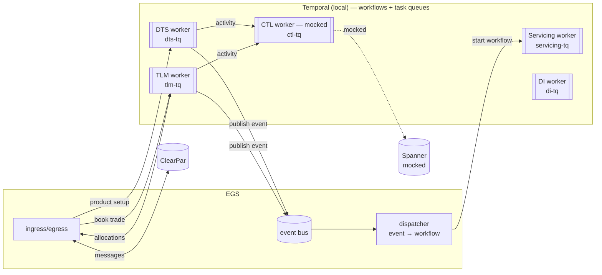
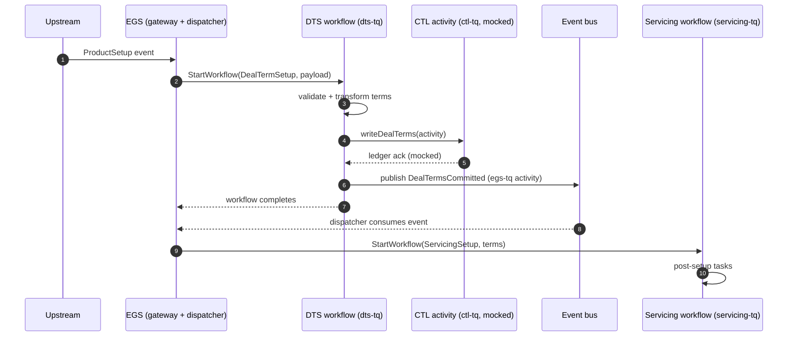
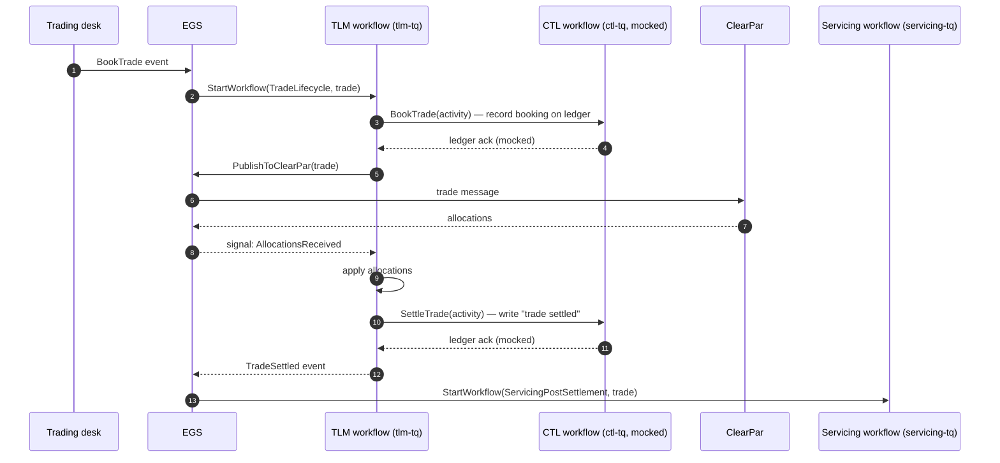

# Loan Transformations — Temporal Orchestration Design

Learning-purpose design for orchestrating loan-platform controllers as Temporal workflows. Runs against a local Temporal server (not production).

## Goal

Model the loan platform as a set of controllers, each with its own Temporal task queue, and orchestrate cross-controller flows as durable workflows. Two flows are in scope for the first pass:

1. **Product setup** — set up a deal's terms, then hand off to servicing.
2. **Book trade** — book a trade through TLM, interact with ClearPar, settle on the ledger, then hand off to servicing.

## Components

| Component | Kind | Task queue | Notes |
|---|---|---|---|
| **EGS** — External Gateway Service | Ingress / egress + event dispatcher | `egs-tq` | Receives external events, exposes a `publish` activity that controllers call to emit domain events, and runs a dispatcher that routes those events to the right downstream workflow. Owns the event → workflow-start routing table. |
| **DTS** — Deal Term Service controller | Workflow worker | `dts-tq` | Owns deal-term setup. Writes terms to the ledger via CTL. |
| **DI** — Document Intelligence controller | Workflow worker | `di-tq` | Placement in the flows is TBD — see open questions. |
| **Servicing** controller | Workflow worker | `servicing-tq` | Picks up post-setup and post-settlement work. |
| **TLM** — Trade Lifecycle Management controller | Workflow worker | `tlm-tq` | Owns the book → allocate → settle lifecycle. Talks to ClearPar via EGS. |
| **CTL** — Spanner Ledger controller | Workflow worker (**mocked**) | `ctl-tq` | The single source of truth for ledger writes (deal terms, trade booking, trade settled). Spanner integration is mocked for now. |
| **ClearPar** | External system | — | Loan trade settlement platform. Reached through EGS. |
| **Temporal server** | Orchestration runtime | — | Local instance. Hosts workflows, signals, and per-controller task queues. |

## High-level architecture

## Flow A — Product setup (choreography across controllers)

Trigger: a `ProductSetup` event arrives at EGS from upstream.

**Within DTS:** orchestration — one `DealTermSetupWorkflow` on `dts-tq` calls `LedgerActivities.writeDealTerms` on `ctl-tq`, then publishes a `DealTermsCommitted` event through `EgsActivities.publish` on `egs-tq`, then ends.

**Between DTS and Servicing:** choreography — DTS has no source-level knowledge of Servicing. `EgsDispatcher` reads events off the bus and looks up the route (`DealTermsCommitted → ServicingSetupWorkflow on servicing-tq`). Adding a new consumer is a new dispatcher route, not a DTS change.

## Flow B — Book trade

Trigger: a `BookTrade` event originates from the trading-desk side, arrives at EGS, and is routed to the TLM event log.

Durable execution: a `TradeLifecycleWorkflow` on `tlm-tq` that owns the whole booking → allocation → settlement lifecycle. It writes to CTL at two points (booking, settled) and round-trips through EGS to ClearPar for allocations. On settlement, it hands off to Servicing.

## Why each controller gets its own task queue

- **Independent scaling.** Each controller's worker pool can scale based on its own load (ledger writes vs. external round-trips are very different shapes).
- **Failure isolation.** A stuck activity in CTL doesn't starve DTS or TLM workers.
- **Clear ownership.** Activity routing is explicit — a workflow on `tlm-tq` calling a CTL activity has to target `ctl-tq`.
- **Mocking surface.** CTL being on its own queue makes it trivial to swap the mocked worker for a real Spanner-backed one later without touching callers.

## What "mocked CTL" means here

The CTL worker registers the same activity signatures it will have in production (`WriteDealTerms`, `BookTrade`, `SettleTrade`), but the implementations return canned acks and log the payload instead of writing to Spanner. Callers (DTS, TLM) don't know the difference.

## Decisions so far

- **Paradigm by boundary.** Orchestration **inside** a bounded context (each controller is one Temporal workflow). Choreography **between** bounded contexts (controllers publish/consume domain events through EGS). See the conversation around the DTS→Servicing refactor for the reasoning.
- **EGS is medium-weight.** Owns the inter-domain event → workflow-start routing table; does not run the step-by-step business saga inside any controller. That resolves the earlier "thin vs. fat EGS" question.
- **Ledger writes are activities, not events.** CTL is part of each controller's saga (atomic with the state transition, idempotent, replay-safe), so it stays an activity call. Wrapping CTL writes as events would lose compensation guarantees.

## Open questions

1. **Where does DI (Document Intelligence) fit?** It's a controller but doesn't appear in either flow above. Candidates: a pre-step before DTS (extract terms from a term-sheet PDF), or a parallel branch driven by a `DocumentReceived` event.
2. **Event bus durability.** Today the bus is in-memory (lost on restart). Production needs Kafka, a transactional outbox, or equivalent so events can't be lost between "CTL ack" and "event published."
3. **EGS ↔ workflow interaction for ClearPar round-trip (Flow B).** Temporal **signal** back into the running TLM workflow, or polling via an activity? Signals are more idiomatic for "wait for an external event."
4. **Idempotency keys.** Each cross-controller call (especially CTL writes) should carry a workflow-derived idempotency key so retries don't double-write.
5. **Event schema versioning.** Now that domain events are the contract between controllers, breaking changes to event shape break consumers silently. Versioning policy needed before more than two events exist.
6. **Replay safety in mocked CTL.** Even mocked, the CTL activities should be deterministic and safe to retry — otherwise the mock will hide bugs that the real Spanner client would also have.

## Next step (suggested)

Stand up the skeleton: a Temporal worker per controller (all in one process is fine for learning), each registered on its own task queue, with no-op activities. Then implement Flow A end-to-end with mocked CTL before touching TLM/ClearPar. Flow B is meaningfully harder because of the ClearPar round-trip — getting Flow A working first will force the EGS-scope decision above.
